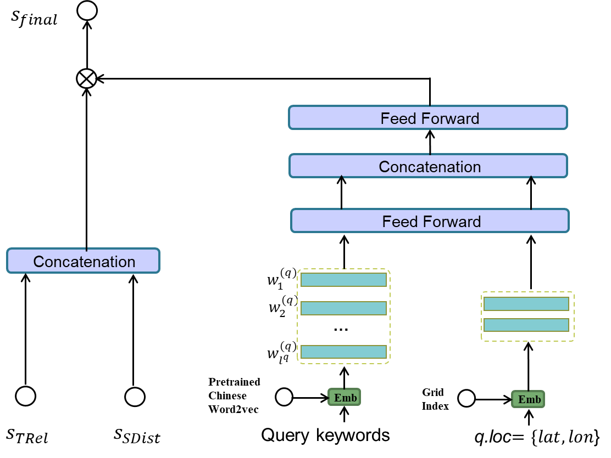

# DrW
### Code for 'Deep Relevance with Weights Learning for Spatial Keyword Queries' paper (SIGMOD 2023)

DrW is a deep relevance with weights learning framework for spatial keyword queries. It is featured with two novel ideas: First, we propose a neural network architecture to learn the textual relevance matching over the local interaction between the query and geo-textual objects. Second, we develop a learning based method to learn the query-dependent weight for textual relevance and spatial proximity.

### Requirements

* Python 3.7
* Pytorch 1.2
* pytorch_transformers 1.2
* tensorboard 1.14

Install required packages
```

pip intall -r requirements.txt
```

### DrW
The following image depicts the framework of DrW. The left one illustrates the textual relevance learning, in which local interaction nework and attention mechanism is adopted to learn the semantic matching between query and POI texts. The right one show the weights learning for textual and spatial score, in which query texts and query location affect the results.




### Datasets
'./Datasets/POI_text.csv' includes all POIs in Beijing dataset.

'./Datasets/query_text.csv' includes the spatial keywords queries that are posed by users from Beijing dataset.

'./Datasets/test.csv' provides a subset of click records which is used to reproducce the experiemental results. Each click record consists of a spatial keyword query posed by a user and the POI that he/her clicked. The clicked POI is the ground-truth of the corresponding spatial keyword query and is labled as "1"


### Testing

To test DrW 

```

python run.py
```

The expected output:

```
Validation: normalized_discounted_cumulative_gain_3: 0.5944 - normalized_discounted_cumulative_gain_5: 0.6064 - normalized_discounted_cumulative_gain_10: 0.6157 - mean_reciprocal_rank: 0.5811
```

This can reproduce NDCG@3, NDCG@5, and MRR of our model on Beijing dataset.